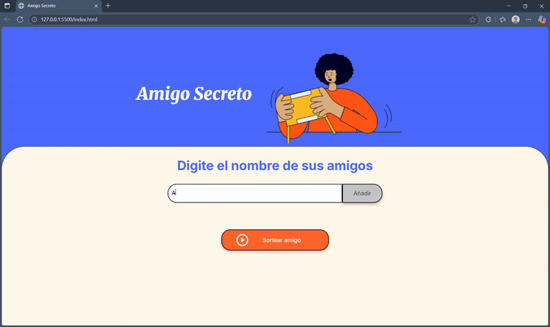

# 🎁 Juego de Amigo Secreto

Aplicación web simple para organizar un sorteo de “Amigo Secreto”.  
Permite **agregar nombres** a una lista, **validarlos** y **sortear** un participante al azar, mostrando el resultado en pantalla y limpiando la lista según la lógica del juego.

## 🎥 Vista en acción

  

## 🚀 Características

- Agregar nombres desde un input con validación (evita vacíos y solo espacios).
- Mostrar dinámicamente la lista de nombres.
- Sorteo aleatorio de un amigo secreto.
- Limpieza/actualización de la lista tras el sorteo.
- Interfaz sencilla y responsive.

## 🛠️ Tecnologías

- **HTML5** — estructura.
- **CSS3** — estilos y layout.
- **JavaScript (ES6)** — lógica de la aplicación y manipulación del DOM.

🧾 Licencia

Este proyecto está bajo la MIT License.
Siéntete libre de usarlo, modificarlo y compartirlo.